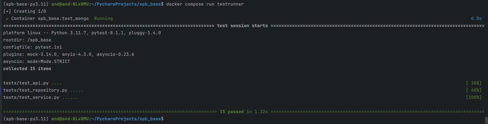

# TDD lab4 + 5

## Run tests

### Build testrunner image

```shell
docker compose build testrunner
```

### Run testrunner

```shell
docker compose run testrunner
```

### Test results

15 tests in total

